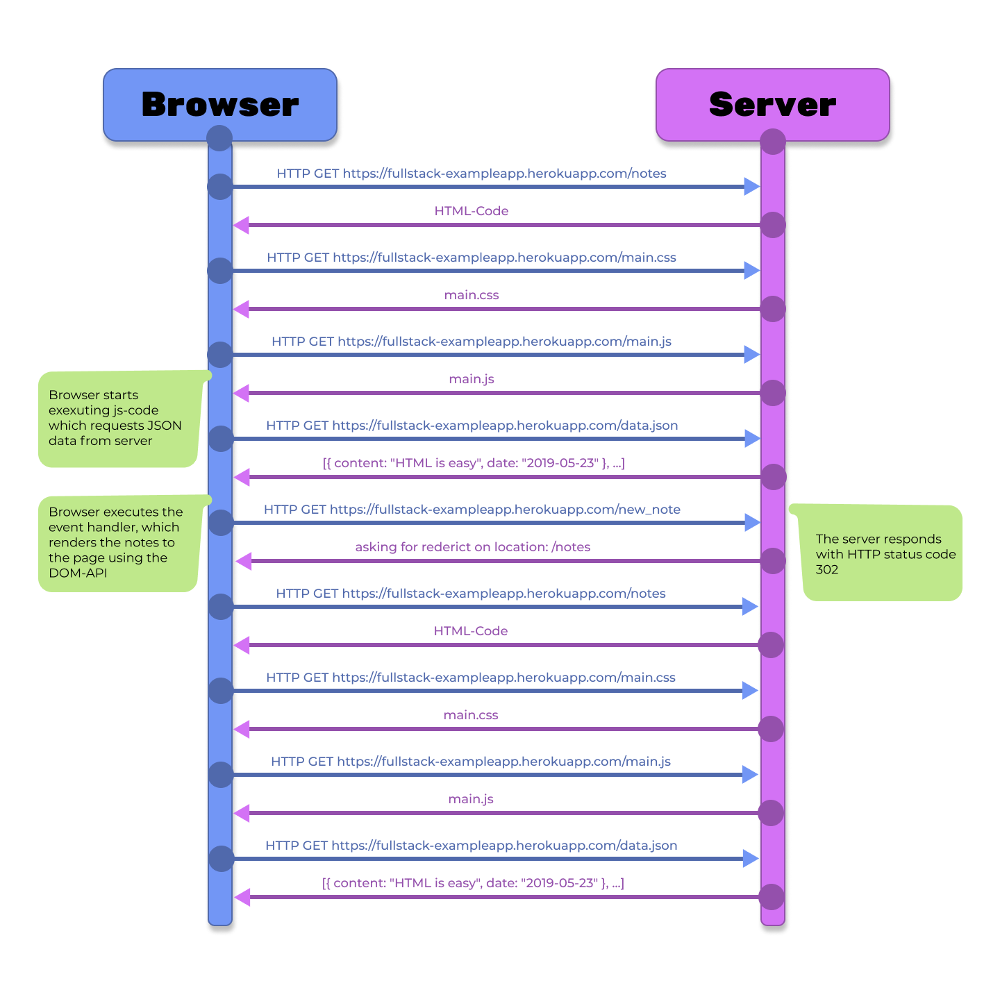
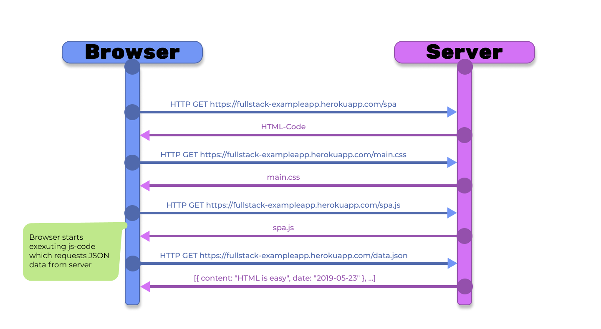
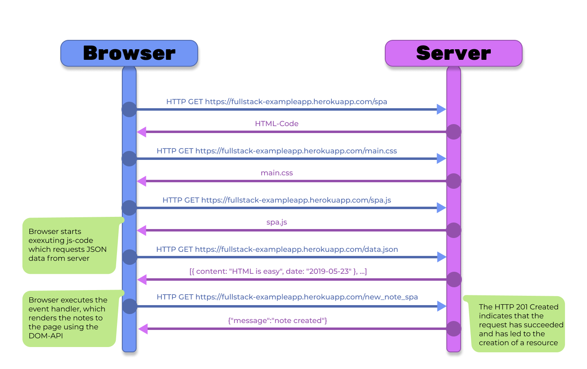

# Part 0
[Assignment](https://fullstackopen.com/en/part0/fundamentals_of_web_apps#exercises-0-1-0-6) 

Diagram designed with [Figma ](https://www.figma.com/file/aBdmrjBKspQI0G3dyzV3Db/HTTP?node-id=5%3A0)

## 0.4 new note
In chapter Loading a page containing JavaScript - revised the chain of events caused by opening the page https://fullstack-exampleapp.herokuapp.com/notes is depicted as a sequence diagram

## 0.5 Single page app

Create a diagram depicting the situation where the user goes to the single page app version of the notes app at https://fullstack-exampleapp.herokuapp.com/spa.

## 0.6  New note 
Create a diagram depicting the situation where user creates a new note using the single page version of the app.

